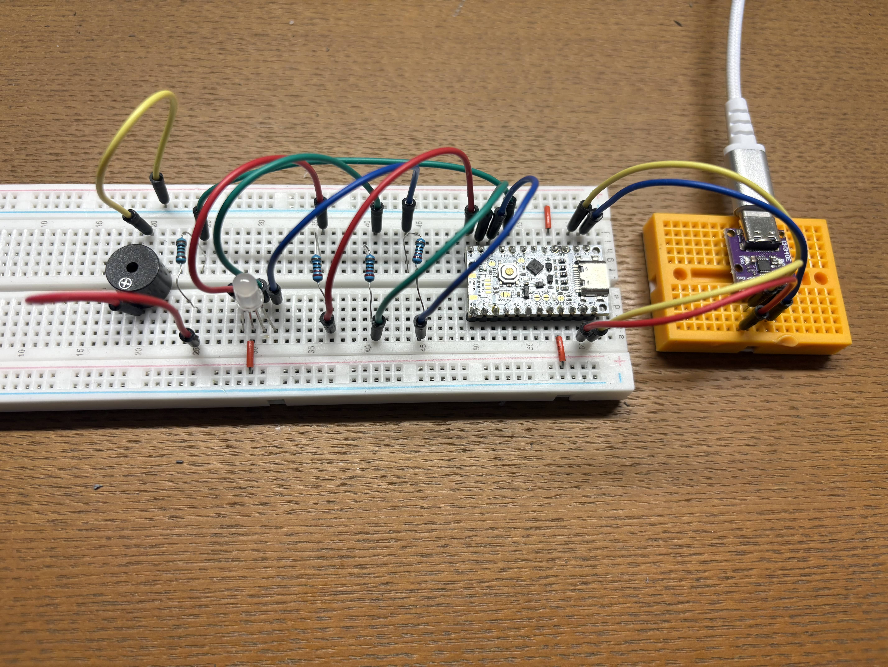

# Misskey_Nostr_Notifier

## Overview
Misskey_Nostr_Notifier is a device and program that detects notifications from Misskey and Nostr, using the Arduino-compatible **UIAPduino** and Node.js.

When a Misskey notification is received, the LED lights up green; when a Nostr notification is received, it lights up purple.\
A passive buzzer also sounds to alert you.

### Supported Notifications
#### Misskey
All notifications delivered as notifications

#### Nostr
Supported event kinds\
Note: your public key must be included in the p tag of the post

- 1 Mention in post
- 4 DM (NIP-04)
- 6 Repost
- 7 Reaction
- 8 Badge award
- 16 Generic repost
- 42 Channel message
- 1059 DM (NIP-17)
- 9735 Zap
- 30023 Long-form post

## misskey_nostr_notifier_node
This folder contains the program that runs on Node.js.\
The `docs` folder inside contains documentation about the program.

## misskey_nostr_notifier_uiap
This folder contains the programs related to hardware.

## Environment

### Hardware
- UIAPduino Pro Micro CH32V003 V1.4
- USB Serial Converter Module (CH340E)
- platformIO Core 6.1.18 · Home 3.4.4
- platform-ch32v https://github.com/Community-PIO-CH32V/platform-ch32v

See the circuit diagram and `platform.ini` for other details.

### Software
- Node.js v24.11.1

See `package.json` and `package-lock.json` for other details.

### Circuit Diagram Example
<image src="img/notifier_circuit.png">


## Setup

### Hardware
```
git clone https://github.com/moyashi170607/Misskey_Nostr_Notifier.git
```

First, let's explain the device setup.\
Build the device based on the circuit diagram and photos mentioned above.

Then, enter the following command:
```
cd misskey_nostr_notifier_uiap
```
The program is written in `src/main.c`.\
Change the LED and buzzer pin numbers as needed.

The platformIO settings are configured for UIAPduino.\
Modify as needed.

Connect the microcontroller to a USB port in write mode using a cable with data lines, then run the following command\
(Be careful not to accidentally connect to the USB socket on the serial communication device side)

```
pio run --target upload --environment genericCH32V003F4P6
```

If the upload succeeds, the hardware setup is complete.

### Software

```
cd ../
cd misskey_nostr_notifier_node
npm install
touch config.yml
```

Then edit the following file:

#### config.yml
```
PK_HEX: Your Nostr public key (HEX format)
RELAY:
  - WebSocket URL of relay server 1
  - URL2
  - URL3

MISSKEY_ORIGIN: Origin (URL) of the Misskey instance to connect to
MISSKEY_API: Your Misskey account API key

PORT: Port to which the microcontroller is connected
```

Once these settings are done, plug in the USB socket of the device's USB serial converter module to connect it to your PC.

Then run the following command:
```
npm run start
```

If the serial communication is established and connections to each server are confirmed, you're done.

## Contributing
Issues and PRs are both welcome.

## Acknowledgements
We would like to thank all the communities and resources involved in this project, including the PlatformIO community, UIAPduino community, Nostr community, Misskey community, and platform-ch32v community.

## Links
- UIAPduino official https://www.uiap.jp/
- platform-ch32v https://github.com/Community-PIO-CH32V/platform-ch32v\
  Installation guide:
  https://pio-ch32v.readthedocs.io/en/latest/installation.html#install-platformio

## License
This project is licensed under the MIT License. See the LICENSE file for details.

---

## 概要
Misskey_Nostr_Notifierは、Arudino互換機である**UIAPduino**とNode.jsを用いたMisskeyとNostrの通知を検知するデバイス、プログラムです。

Misskeyの通知を受け取るとLEDが緑色に、Nostrの通知を受け取ると紫色に光ります。\
また、パッシブブザーの音でも知らせます。

### 対応している通知
#### Misskey
通知として届くもの全て

### Nostr
対応しているイベントのkind\
ただし、投稿のpタグに自身の公開鍵が含まれてる必要あり

- 1 投稿内のメンション
- 4 DM(NIP-04)
- 6 リポスト
- 7 リアクション
- 8 バッジの授与
- 16 汎用リポスト
- 42 チャンネルメッセージ
- 1059 DM(NIP-17)
- 9735 Zap
- 30023 長文投稿


## misskey_nostr_notifier_node
このフォルダにはNode.js上で動くプログラムが含まれています。\
またフォルダ内のdocsには、プログラムについてのドキュメントがあります。

## misskey_nostr_notifier_uiap
このフォルダにはハードウェアに関するプログラムが含まれています。

## 環境構築

### ハードウェア
- UIAPduino Pro Micro CH32V003 V1.4
- USBシリアル変換モジュール (CH340E)
- platformIO Core 6.1.18·Home 3.4.4
- platform-ch32v https://github.com/Community-PIO-CH32V/platform-ch32v

その他は回路図や`platform.ini`を参照

### ソフトウェア
- Node.js v24.11.1

その他は`package.json`および`package-lock.json`を参照

### デバイスの回路図例
<image src="img/notifier_circuit.png">


## セットアップ

### ハードウェア
```
git clone https://github.com/moyashi170607/Misskey_Nostr_Notifier.git
```

まずはデバイスのセットアップについて説明します。\
先述の回路図や写真をもとにデバイスを作成してください。

その後、次のコマンドを入力してください。
```
cd misskey_nostr_notifier_uiap
```
`src/main.c`に、プログラムが書かれています。
必要に応じてLEDやブザーのピンの番号などを変更してください。

各種platformIOの設定はUIAPduinoに合わせて設定されています。
必要に応じて変更してください。

マイコンを情報線のあるケーブルなどを用いてUSBポートに書き込みモードで接続し、以下のコマンドを実行してください\
(誤ってシリアル通信デバイス側のUSBソケットに接続しないように注意してください)

```
pio run --target upload --environment genericCH32V003F4P6
```

書き込みが成功すれば、無事ハードウェアのセットアップは完了です。

### ソフトウェア

```
cd ../
cd misskey_nostr_notifier_node
npm install
touch config.yml
```

その後、以下のファイルを編集してください

#### config.yml
```
PK_HEX: あなたのNostr公開鍵（HEX形式）
RELAY:
  - リレーサーバーのWebSocketのURL1
  - URL2
  - URL3

MISSKEY_ORIGIN: 接続するMisskeyインスタンスのオリジン(URL)
MISSKEY_API: あなたのMisskeyアカウントAPIキー

PORT: マイコンを接続するポート
```

これらの設定が済んだら、デバイスのUSBシリアル変換モジュールのUSBソケットにプラグを差し込みパソコンと接続してください。

その後、以下のコマンドを実行しましょう。
```
npm run start
```

無事シリアル通信が確立し、各種サーバーとの接続が確認出来たら成功です。

## コントリビュート
issue, PR どちらも大歓迎です。

## 謝辞
PlatformIOコミュニティ、UIAPduinoコミュニティ、Nostrコミュニティ、Misskeyコミュニティ、platform-ch32vコミュニティ等、本プロジェクトに関わるあらゆる方々、リソースに感謝します。

## リンク集
- UIAPduino公式 https://www.uiap.jp/
- platform-ch32v https://github.com/Community-PIO-CH32V/platform-ch32v \
  インストール手順
  https://pio-ch32v.readthedocs.io/en/latest/installation.html#install-platformio

## ライセンス
このプロジェクトはMITライセンスの下でライセンスされています。詳細についてはLICENSEファイルを参照してください。